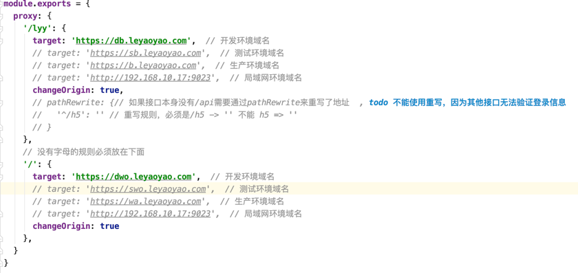
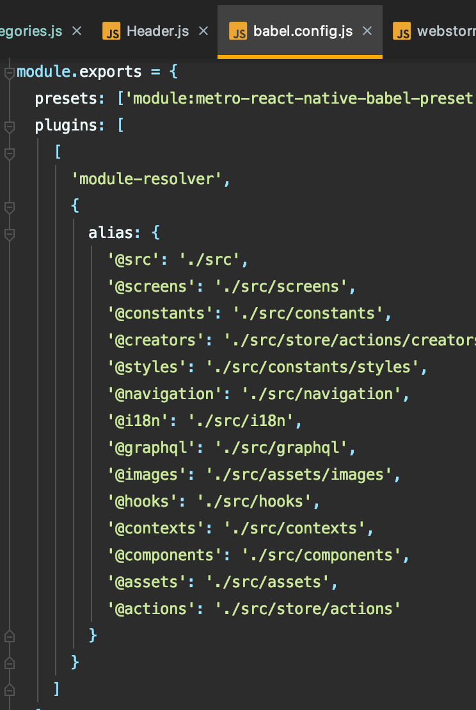
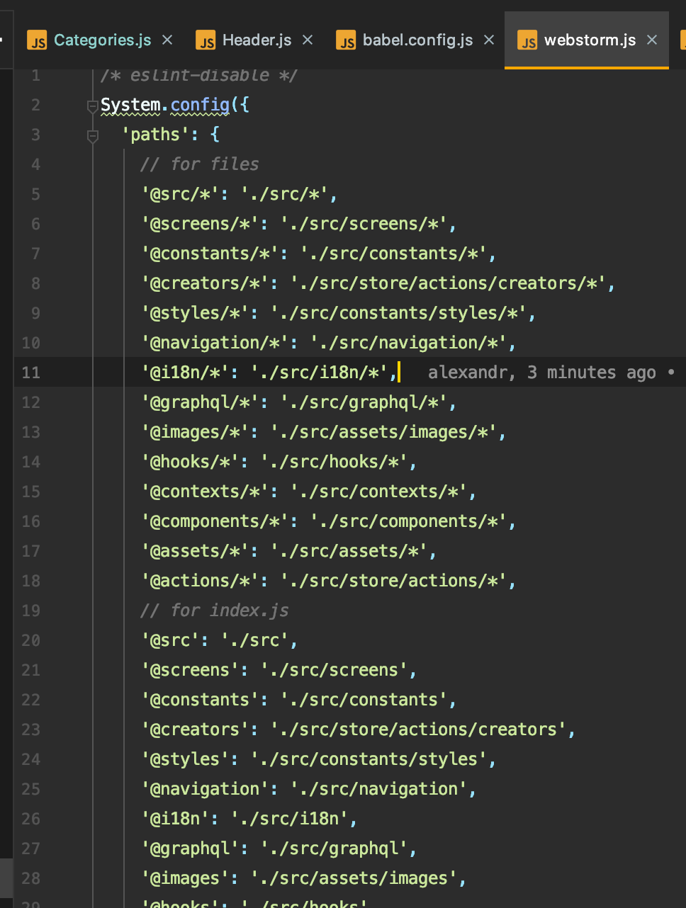

> A Vue.js project for h5-pc
https://blog.csdn.net/ZFL_123456/article/details/86651316
## Build Setup

``` bash
# install dependencies
npm install / yarn

# serve with hot reload at localhost:8080
npm run dev / yarn start

# build for production with minification
npm run build / yarn build

# build for production and view the bundle analyzer report
npm run build --report
```
## 本地代理开发


## webstormConfig.js -- 别名点击可以跳转的配置
https://youtrack.jetbrains.com/issue/WEB-22717#comment=27-1558931


